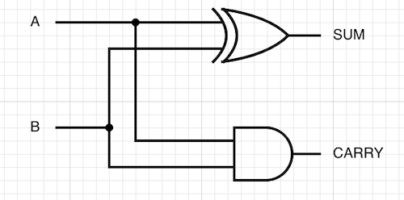

# CS101A Assignment 7

> 11510225 Yuxing Hu (胡与兴)

### Q1: count the cells

* 2 hexadecimal digits: 16^2 = 256
* 4 hexadecimal digits: 16^4 = 65536

### Q2: most significant bit 

* a. 8F -> 10001111 -> 1
* b. FF -> 11111111 -> 1
* c. 6F -> 01101111 -> 0
* d. 1F -> 00011111 -> 0

### Q3: binary notation

* a. 5.75: 101.11
* b. 15.9375: 1111.1111
* c. 5.375: 101.011
* d. 1.25: 1.01

### Q4: how many photos

Length\*width\*pixels = 1024 x 1024 x 3 = 3145728 bytes per photo. 

Megabytes\*kilobytes\*bytes = 256 * 1024 * 1024 = 268435456 bytes available storage 

Bytes storage / bytes per photo = 268435456 / 3145728 = 85.333333(etc) 

Convert to integer(if needed): 85 photos

### Q5: half-adder

* a. SUM = A' · B + A · B' ; CARRY = A · B
* b.

