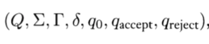

# Assignment 2

> 11510225 Yuxing Hu (胡与兴)

### 1. True or False

1.  “Computer Science “is a wrong name as a discipline, from the viewpoints of either science or engineering：**True**
2. It is the “decision problem” leads to the notion and/or concept of “computation”, and motivates research on computability: **True**

### 2. Turing machine

1. The components of a Turing machine

   Turing machine can be formally defined as a 7-tuple: 

   

2. Their functions

   * Q is a finite, non-empty set of *states*;
   * Sigma is the set of *input symbols*, that is, the set of symbols allowed to appear in the initial tape contents;
   * Gamma is a finite, non-empty set of *tape alphabet symbols*;
   * b is the *blank symbol* (the only symbol allowed to occur on the tape infinitely often at any step during the computation);
   * Delta is a partial function called the *transition function*, where L is left shift, R is right shift. (A relatively uncommon variant allows "no shift", say N, as a third element of the latter set.
   * q0 is the *initial state*;
   * qaccept is the set of *final states* or *accepting states*.
   * qreject is the reject state where isn't equal with qaccept

3. Eexplain how a Turing machine works in your own words

   Start by filling the string of input symbols from left to right on the n-th grid of the tape and leave the rest blank (that is, fill in the blanks). The read and write head of M points to grid zeroth, and M is in state Q0. After the machine starts running, it is calculated according to the rules described by the transfer function Delta. For example, if the current state of the machine is q, the symbol in the lattice referred to by the read-write header is x, and if Delta (q, x) = (q', x', L), the machine enters the new state q', changes the symbol in the lattice referred to by the read-write header to x', and then moves the read-write header to the left by moving a lattice. At some point, the read-write header refers to the number 0 grid, but according to the transfer function it will continue to move to the left next time, when it stops in place. In other words, the read and write head is never removed from the left border of the paper tape. If M enters the state qreject according to the transition function at a certain time, it immediately stops and accepts the input string; if M enters the state qreject according to the transition function at a certain time, it immediately stops and rejects the input string.

### 3. Job lists

1. List at least two jobs for computer science, computer technology/engineering

   * Computer science:
     * Software Engineer
     * Mobile App Developer
     * UI/UX Designer
     * Computer Scientist
     * Web Designer
     * Data Scientist
     * Systems Analyst
   * Computer technology/engineering
     - Electrical Engineer
     - Electronics Architect
     - Computer Hardware Engineer
     - Mechanical Engineer
     - Microchip Architect
     - Mobile Device Engineer
     - Quality Control Engineer

2. Reasons (differences between science and technology/engineering)

   Both majors are heavy in theory and practical application, which is vital for building a strong knowledge base for a range of IT careers, however, the key difference is that **computer science focuses on software**, while **computer engineering is more about the hardware**.